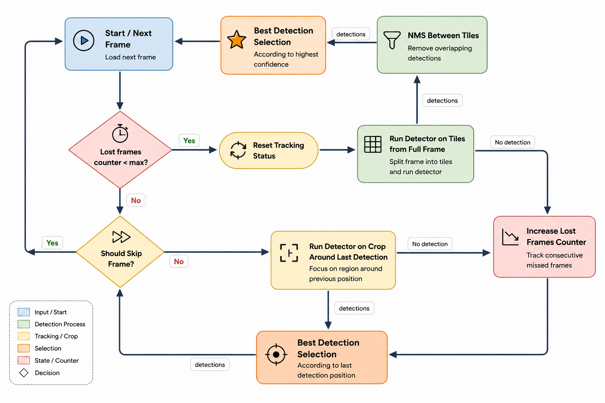

# ⚽ Soccer Ball Position Prediction
## Overview

This project implements a soccer ball tracking pipeline for broadcast football videos.


The system combines:

- A YOLO-based ball detector
- A lightweight tracking module
- Temporal recovery logic for missed detections

For each video frame, the pipeline:

1. Detects the ball.
2. Tracks the ball position over time.
3. Exports predictions to CSV.
4. Generates an annotated output video.
5. Collects runtime performance metrics.

---

## Installation

### Prerequisites

- Python 3.12
- Git
- Make

### Setup

```bash
git clone https://github.com/CristinaMelicio/show-ball.git
cd show-ball

make install
source venv/bin/activate

make check
make test
```

Optional TensorRT export (this was not fully successful due to FP16 export issues):

```bash
make export_to_tensorrt
```

---

## Tracking Pipeline



The tracker operates in two modes:

### Local Search

When the ball was successfully detected in previous frames, inference is performed on a crop centered around the last known ball position.

This significantly reduces computation and allows the system to process videos close to real time.

### Global Recovery

If the detector fails to find the ball for several consecutive frames, the tracker resets and performs detection over the full frame using overlapping tiles.

Detections from all tiles are merged using Non-Maximum Suppression (NMS), and the best detection is used to reinitialize tracking.

### Run Tracking

```bash
python -m show_ball.run_show_ball \
    --video-path resources/video.mp4 \
    --weights-path runs/weights/best.pt \
    --output-path output \
    --device auto \
    --show
```

### Outputs

The pipeline generates:

- `predictions.csv` containing ball coordinates for each frame
- Annotated output video
- Runtime performance statistics

---

## Evaluation

Predictions are compared against ground-truth annotations on a frame-by-frame basis.

A prediction is considered correct when the Euclidean distance between the predicted and annotated ball position is less than 10 pixels.

Run evaluation:

```bash
python -m show_ball.evaluate_show_ball \
    --predictions-path outputs/predictions.csv \
    --ground-truth-path resources/ground_truth.csv
```

Reported metrics include:

- Precision
- Recall
- F1 Score
- Recall @ 5 / 10 / 20 pixels
- Mean localization error
- Median localization error
- P95 localization error
- Missing detection rate

---

## Dataset Generation

The detector is trained using tiled crops extracted from football videos.

Because the ball occupies only a few pixels in the original broadcast frame, training is performed on **640×640 tiles**, matching the detector input resolution.

### Dataset Split

To avoid temporal leakage, videos are divided into contiguous segments of:

```text
1800 frames = 30 seconds at 60 FPS
```

Segments are randomly assigned to:

- Train: 70%
- Validation: 15%
- Test: 15%

### Positive Samples

For frames containing a visible ball annotation:

- One or more tiles are generated around the annotated position.
- Random jitter is applied so the ball appears at different locations inside the crop.
- YOLO annotations are generated automatically.

To reduce redundancy, only every N-th annotated frame is used:

```text
frame_stride = 10
```

This avoids training on nearly identical consecutive frames.

### Negative Samples

Random tiles that do not contain the annotated ball are generated from positive frames.

These samples teach the detector to reject grass, players, field markings, and spectators.

### Hard Negatives

Frames without annotations are treated as potential ball occlusions.

The expected ball position is estimated by interpolating neighboring annotations.

A tile centered on the estimated location is then saved as a negative sample.

These hard negatives help reduce false positives in situations where the ball is hidden behind players or visually ambiguous.

### Dataset Structure

```text
dataset/
├── data.yaml
├── split_record.json
├── images/
│   ├── train/
│   ├── val/
│   └── test/
└── labels/
    ├── train/
    ├── val/
    └── test/
```

The dataset follows the standard YOLO detection format.

---

## Results

Evaluation on the test split produced:

| Metric | Value |
|----------|---------:|
| Precision | 0.914 |
| Recall | 0.859 |
| F1 Score | 0.886 |
| Recall @ 5 px | 0.687 |
| Recall @ 10 px | 0.859 |
| Recall @ 20 px | 0.922 |
| Mean Error | 10.21 px |
| Median Error | 3.16 px |
| P95 Error | 13.34 px |
| Missing Detection Rate | 6.56% |

The tracker achieves high localization accuracy while maintaining a low missed-detection rate.

---

## Runtime Performance

Benchmarked on an Apple Silicon M2 MacBook:

| Metric | Value |
|----------|---------:|
| Video FPS | 60.0 |
| Processing FPS | 44.15 |
| Real-Time Factor | 0.74× |
| Mean CPU Usage | 76.2% |
| Peak Memory Usage | 422.7 MB |

---

## Future Work

- Improve TensorRT export and FP16 support.
- Implement a TensorRT-based predictor using CuPy.
- Train on additional matches and camera conditions.
- Increase robustness against player-foot false positives.
- Improve ball recovery after long occlusions.